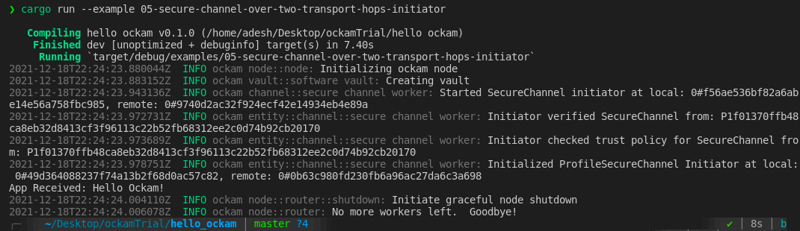

## Setting up Ockam secure channel
I went over Ockam [documentation](https://github.com/ockam-network/ockam/tree/develop/documentation/guides/rust/get-started) to setup a scure channel.
Here is the screenshot of Hello Ockam! echoed in a secure channel:

